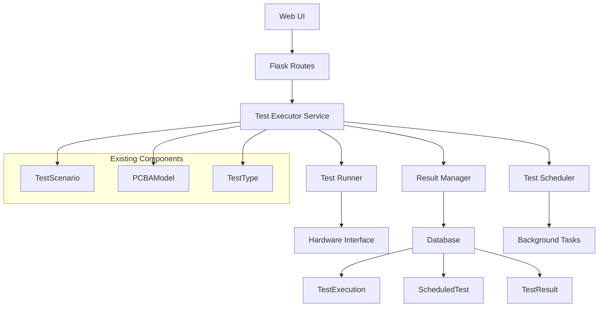

# Otomatik Test Çalıştırma Sistemi - Tasarım Dokümanı

## Genel Bakış

Bu tasarım, mevcut PCBA test sistemine otomatik test çalıştırma, zamanlama ve izleme yetenekleri ekler. Sistem, mevcut test senaryolarını kullanarak manuel ve otomatik testleri destekler.

## Mimari

### Sistem Bileşenleri



## Bileşenler ve Arayüzler

### 1. Veritabanı Modelleri

#### TestExecution Modeli
```python
class TestExecution(db.Model):
    id = db.Column(db.Integer, primary_key=True)
    test_scenario_id = db.Column(db.Integer, db.ForeignKey('test_scenario.id'))
    pcba_model_id = db.Column(db.Integer, db.ForeignKey('pcba_model.id'))
    serial_number = db.Column(db.String(50))
    status = db.Column(db.String(20))  # RUNNING, COMPLETED, FAILED, CANCELLED
    start_time = db.Column(db.DateTime)
    end_time = db.Column(db.DateTime)
    execution_type = db.Column(db.String(20))  # MANUAL, SCHEDULED
    user_id = db.Column(db.Integer, db.ForeignKey('user.id'))
    progress = db.Column(db.Integer, default=0)
    current_step = db.Column(db.String(100))
    error_message = db.Column(db.Text)
    test_data = db.Column(db.JSON)
```

#### ScheduledTest Modeli
```python
class ScheduledTest(db.Model):
    id = db.Column(db.Integer, primary_key=True)
    name = db.Column(db.String(100))
    test_scenario_id = db.Column(db.Integer, db.ForeignKey('test_scenario.id'))
    pcba_model_id = db.Column(db.Integer, db.ForeignKey('pcba_model.id'))
    schedule_type = db.Column(db.String(20))  # ONCE, DAILY, WEEKLY, MONTHLY
    schedule_time = db.Column(db.Time)
    schedule_days = db.Column(db.String(20))  # For weekly: "1,3,5"
    next_run = db.Column(db.DateTime)
    last_run = db.Column(db.DateTime)
    is_active = db.Column(db.Boolean, default=True)
    created_by = db.Column(db.Integer, db.ForeignKey('user.id'))
    notification_emails = db.Column(db.Text)
```

#### TestConfiguration Modeli
```python
class TestConfiguration(db.Model):
    id = db.Column(db.Integer, primary_key=True)
    key = db.Column(db.String(50), unique=True)
    value = db.Column(db.Text)
    description = db.Column(db.Text)
    data_type = db.Column(db.String(20))  # STRING, INTEGER, BOOLEAN, JSON
```

### 2. Test Executor Service

#### TestExecutorService Sınıfı
```python
class TestExecutorService:
    def __init__(self):
        self.running_tests = {}
        self.test_queue = Queue()
        
    def start_manual_test(self, test_scenario_id, pcba_model_id, serial_number, user_id):
        """Manuel test başlatır"""
        
    def start_scheduled_test(self, scheduled_test_id):
        """Zamanlanmış test başlatır"""
        
    def stop_test(self, execution_id):
        """Çalışan testi durdurur"""
        
    def get_test_status(self, execution_id):
        """Test durumunu döndürür"""
        
    def get_running_tests(self):
        """Çalışan testleri listeler"""
```

#### TestRunner Sınıfı
```python
class TestRunner:
    def __init__(self, execution_id):
        self.execution_id = execution_id
        self.execution = None
        self.is_cancelled = False
        
    def run(self):
        """Test çalıştırma ana metodu"""
        
    def execute_test_step(self, step_name, test_function):
        """Tek bir test adımını çalıştırır"""
        
    def update_progress(self, progress, current_step):
        """İlerleme durumunu günceller"""
        
    def handle_error(self, error):
        """Hata durumunu yönetir"""
```

### 3. Test Scheduler

#### TestScheduler Sınıfı
```python
class TestScheduler:
    def __init__(self):
        self.scheduler = BackgroundScheduler()
        
    def start(self):
        """Scheduler'ı başlatır"""
        
    def add_scheduled_test(self, scheduled_test):
        """Yeni zamanlanmış test ekler"""
        
    def remove_scheduled_test(self, scheduled_test_id):
        """Zamanlanmış testi kaldırır"""
        
    def update_scheduled_test(self, scheduled_test):
        """Zamanlanmış testi günceller"""
        
    def check_and_run_tests(self):
        """Çalışması gereken testleri kontrol eder"""
```

### 4. Web API Endpoints

#### Test Execution API
- `POST /api/test/start` - Manuel test başlatma
- `GET /api/test/status/<execution_id>` - Test durumu sorgulama
- `POST /api/test/stop/<execution_id>` - Test durdurma
- `GET /api/test/running` - Çalışan testler listesi
- `GET /api/test/history` - Test geçmişi

#### Scheduled Tests API
- `GET /api/scheduled-tests` - Zamanlanmış testler listesi
- `POST /api/scheduled-tests` - Yeni zamanlanmış test oluşturma
- `PUT /api/scheduled-tests/<id>` - Zamanlanmış test güncelleme
- `DELETE /api/scheduled-tests/<id>` - Zamanlanmış test silme
- `POST /api/scheduled-tests/<id>/toggle` - Zamanlanmış test aktif/pasif

#### Configuration API
- `GET /api/test-config` - Test konfigürasyonları
- `PUT /api/test-config` - Test konfigürasyonları güncelleme

### 5. Kullanıcı Arayüzü Sayfaları

#### Test Çalıştırma Sayfası (`/test-execution`)
- Aktif test senaryoları listesi
- PCBA model seçimi
- Seri numara girişi
- Test başlatma butonu
- Çalışan testler paneli

#### Test İzleme Sayfası (`/test-monitoring`)
- Gerçek zamanlı test durumu
- İlerleme çubukları
- Anlık test verileri
- Test durdurma kontrolleri

#### Zamanlanmış Testler Sayfası (`/scheduled-tests`)
- Zamanlanmış testler listesi
- Yeni zamanlama oluşturma formu
- Zamanlama düzenleme
- Aktif/pasif durumu yönetimi

#### Test Sonuçları Sayfası (`/test-results-advanced`)
- Gelişmiş filtreleme
- Test sonuçları analizi
- Grafik görünümler
- Rapor oluşturma

#### Test Konfigürasyonu Sayfası (`/test-configuration`)
- Timeout ayarları
- Retry sayısı
- Bildirim ayarları
- Log seviyesi

## Veri Modelleri

### Test Execution Data Structure
```json
{
  "execution_id": "12345",
  "test_scenario": {
    "id": 1,
    "name": "Standard Electronics Test",
    "parameters": {...}
  },
  "pcba_model": {
    "id": 1,
    "part_number": "PCB-001"
  },
  "status": "RUNNING",
  "progress": 45,
  "current_step": "Voltage Test",
  "start_time": "2024-01-15T10:30:00Z",
  "test_results": {
    "voltage": {
      "measured": 3.25,
      "expected_min": 3.2,
      "expected_max": 3.4,
      "status": "PASS"
    }
  }
}
```

### Scheduled Test Configuration
```json
{
  "id": 1,
  "name": "Daily Quality Check",
  "test_scenario_id": 1,
  "pcba_model_id": 1,
  "schedule_type": "DAILY",
  "schedule_time": "09:00:00",
  "next_run": "2024-01-16T09:00:00Z",
  "is_active": true,
  "notification_emails": ["admin@taytech.com"]
}
```

## Hata Yönetimi

### Hata Türleri
1. **Connection Errors**: Bağlantı sorunları
2. **Hardware Errors**: Donanım hataları
3. **Timeout Errors**: Zaman aşımı hataları
4. **Validation Errors**: Veri doğrulama hataları
5. **System Errors**: Sistem hataları

### Hata Yönetimi Stratejisi
- Otomatik retry mekanizması
- Detaylı hata loglama
- Kullanıcı bildirim sistemi
- Hata kurtarma prosedürleri

## Test Stratejisi

### Unit Tests
- Model testleri
- Service testleri
- API endpoint testleri

### Integration Tests
- Veritabanı entegrasyonu
- Scheduler entegrasyonu
- Hardware interface testleri

### End-to-End Tests
- Tam test senaryosu çalıştırma
- Zamanlanmış test çalıştırma
- Kullanıcı arayüzü testleri

## Performans Optimizasyonları

### Database Optimizations
- Index'ler: execution_id, status, start_time
- Connection pooling
- Query optimization

### Background Processing
- Celery task queue kullanımı
- Redis cache entegrasyonu
- Asenkron test çalıştırma

### Real-time Updates
- WebSocket bağlantıları
- Server-Sent Events (SSE)
- Efficient polling mechanisms

## Güvenlik Considerations

### Authentication & Authorization
- Test çalıştırma yetkileri
- Zamanlanmış test yönetimi yetkileri
- Konfigürasyon değiştirme yetkileri

### Data Protection
- Test sonuçları şifreleme
- Audit logging
- Secure communication

## Deployment Considerations

### Environment Variables
- Database connection strings
- Redis connection
- Email configuration
- Hardware interface settings

### Service Dependencies
- Redis server
- Background task workers
- Database migrations

### Monitoring
- Test execution metrics
- System performance monitoring
- Error rate tracking
- Alert mechanisms