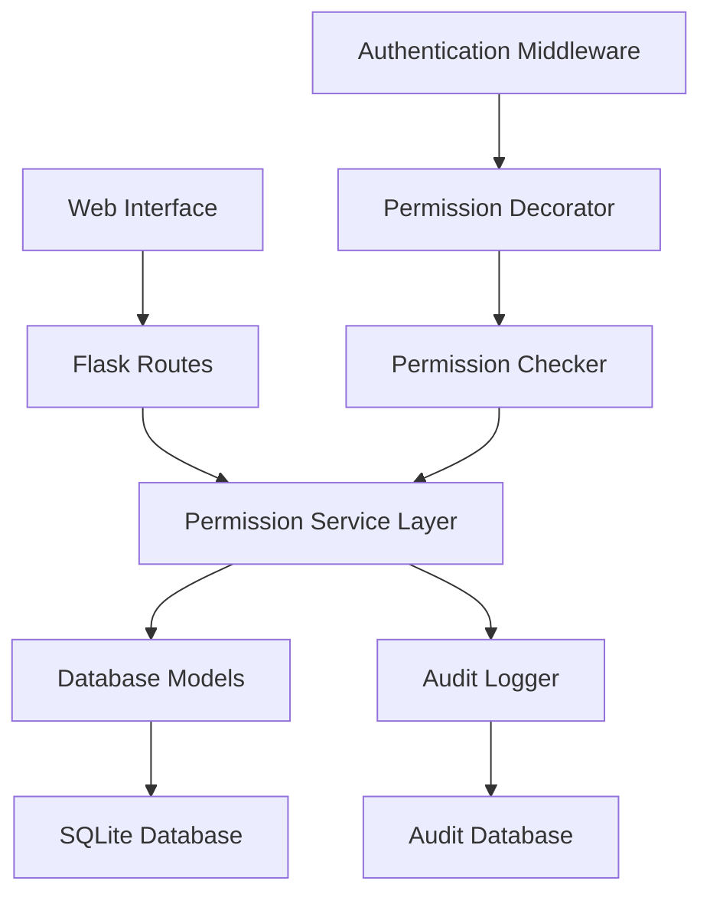
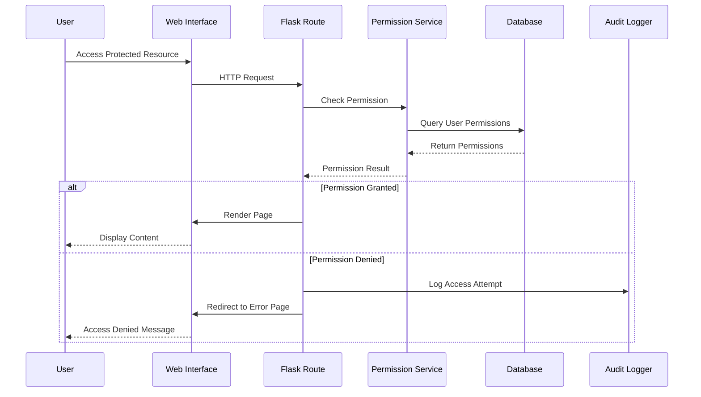

# Design Document - User Permission Management System

## Overview

The User Permission Management System will extend the existing PCBA Test System's basic role-based access control to provide a comprehensive, dynamic permission management solution. The system will integrate seamlessly with the current Flask application architecture, utilizing the existing SQLAlchemy models while adding new functionality for granular permission control.

The design leverages the existing Permission, Role, and UserPermission models already present in the codebase, extending them with additional functionality and creating new web interfaces for management.

## Architecture

### High-Level Architecture



### Component Interaction Flow



## Components and Interfaces

### 1. Database Layer Extensions

#### Enhanced Models
The existing models will be extended with additional methods and relationships:

**Permission Model Extensions:**
- Add `category` field for grouping permissions
- Add `is_system` field to protect critical permissions
- Add methods for permission hierarchy management

**Role Model Extensions:**
- Add `is_default` field for default role assignment
- Add `priority` field for role precedence
- Add methods for bulk permission assignment

**User Model Extensions:**
- Enhance `has_permission()` method with caching
- Add `get_effective_permissions()` method
- Add permission inheritance logic

#### New Models

**PermissionCategory Model:**
```python
class PermissionCategory(db.Model):
    id = db.Column(db.Integer, primary_key=True)
    name = db.Column(db.String(50), unique=True, nullable=False)
    description = db.Column(db.String(200))
    display_order = db.Column(db.Integer, default=0)
```

**AuditLog Model:**
```python
class AuditLog(db.Model):
    id = db.Column(db.Integer, primary_key=True)
    user_id = db.Column(db.Integer, db.ForeignKey('user.id'))
    action = db.Column(db.String(50), nullable=False)
    resource_type = db.Column(db.String(50))
    resource_id = db.Column(db.Integer)
    details = db.Column(db.JSON)
    ip_address = db.Column(db.String(45))
    user_agent = db.Column(db.String(500))
    timestamp = db.Column(db.DateTime, default=datetime.utcnow)
```

### 2. Service Layer

#### PermissionService Class
Central service for all permission-related operations:

```python
class PermissionService:
    @staticmethod
    def check_user_permission(user_id, permission_name)
    
    @staticmethod
    def get_user_effective_permissions(user_id)
    
    @staticmethod
    def assign_role_to_user(user_id, role_id, assigned_by)
    
    @staticmethod
    def grant_individual_permission(user_id, permission_id, granted_by)
    
    @staticmethod
    def bulk_assign_permissions(user_ids, permission_ids, assigned_by)
    
    @staticmethod
    def get_permission_hierarchy()
```

#### AuditService Class
Handles all audit logging functionality:

```python
class AuditService:
    @staticmethod
    def log_permission_change(user_id, action, details, performed_by)
    
    @staticmethod
    def log_access_attempt(user_id, resource, success, ip_address)
    
    @staticmethod
    def get_audit_logs(filters)
    
    @staticmethod
    def cleanup_old_logs(days_to_keep)
```

### 3. Web Interface Layer

#### New Routes and Templates

**Role Management Routes:**
- `/role-management` - List all roles
- `/add-role` - Create new role
- `/edit-role/<id>` - Edit existing role
- `/delete-role/<id>` - Delete role (API)

**Permission Management Routes:**
- `/permissions` - List all permissions by category
- `/add-permission` - Create new permission
- `/edit-permission/<id>` - Edit permission
- `/permission-categories` - Manage categories

**User Permission Routes:**
- `/user-permissions/<user_id>` - Manage individual user permissions
- `/bulk-permissions` - Bulk permission assignment
- `/permission-audit` - View audit logs

**API Routes:**
- `/api/check-permission` - Real-time permission checking
- `/api/user-permissions/<user_id>` - Get user permissions (JSON)
- `/api/bulk-assign` - Bulk operations

### 4. Frontend Components

#### Permission Matrix Interface
Interactive grid showing users vs permissions with checkboxes for quick assignment.

#### Role Builder Interface
Drag-and-drop interface for creating roles with permission categories.

#### Audit Dashboard
Filterable table with charts showing permission usage and access patterns.

## Data Models

### Permission Categories
```
user_management:
  - view_users
  - create_users
  - edit_users
  - delete_users
  - manage_user_permissions

test_management:
  - view_tests
  - run_tests
  - manage_test_types
  - manage_test_scenarios
  - view_test_results

system_management:
  - system_settings
  - manage_connections
  - view_audit_logs
  - manage_roles
  - manage_permissions

reporting:
  - view_reports
  - export_data
  - generate_reports
```

### Permission Inheritance Logic
1. **Role Permissions**: Base permissions from assigned role
2. **Individual Grants**: Additional permissions granted directly
3. **Individual Denials**: Permissions explicitly denied (override role permissions)
4. **System Permissions**: Critical permissions that cannot be denied

### Database Schema Changes

```sql
-- Add new columns to existing tables
ALTER TABLE permissions ADD COLUMN category VARCHAR(50);
ALTER TABLE permissions ADD COLUMN is_system BOOLEAN DEFAULT FALSE;
ALTER TABLE roles ADD COLUMN is_default BOOLEAN DEFAULT FALSE;
ALTER TABLE roles ADD COLUMN priority INTEGER DEFAULT 0;

-- Create new tables
CREATE TABLE permission_categories (
    id INTEGER PRIMARY KEY,
    name VARCHAR(50) UNIQUE NOT NULL,
    description VARCHAR(200),
    display_order INTEGER DEFAULT 0
);

CREATE TABLE audit_logs (
    id INTEGER PRIMARY KEY,
    user_id INTEGER REFERENCES users(id),
    action VARCHAR(50) NOT NULL,
    resource_type VARCHAR(50),
    resource_id INTEGER,
    details JSON,
    ip_address VARCHAR(45),
    user_agent VARCHAR(500),
    timestamp DATETIME DEFAULT CURRENT_TIMESTAMP
);
```

## Error Handling

### Permission Denial Handling
- **Graceful Redirects**: Users without permissions are redirected to appropriate pages
- **Informative Messages**: Clear error messages explaining why access was denied
- **Audit Logging**: All denied access attempts are logged for security monitoring

### Data Validation
- **Role Name Uniqueness**: Prevent duplicate role names
- **Permission Dependencies**: Ensure dependent permissions are granted together
- **Circular Reference Prevention**: Prevent role inheritance loops

### Error Recovery
- **Database Rollback**: All permission changes use database transactions
- **Backup Verification**: Critical permission changes require confirmation
- **Emergency Access**: System admin role cannot be completely locked out

## Testing Strategy

### Unit Tests
- **Permission Logic Tests**: Test all permission checking methods
- **Service Layer Tests**: Test PermissionService and AuditService methods
- **Model Tests**: Test database model relationships and constraints

### Integration Tests
- **Route Protection Tests**: Verify all protected routes enforce permissions
- **UI Integration Tests**: Test permission-based UI element visibility
- **Database Integration Tests**: Test complex permission queries

### End-to-End Tests
- **User Journey Tests**: Complete workflows from role creation to permission enforcement
- **Bulk Operation Tests**: Test bulk permission assignment scenarios
- **Audit Trail Tests**: Verify complete audit logging functionality

### Performance Tests
- **Permission Check Performance**: Ensure permission checks don't slow down the application
- **Database Query Optimization**: Test permission queries with large datasets
- **Caching Effectiveness**: Verify permission caching improves performance

## Security Considerations

### Access Control
- **Principle of Least Privilege**: Users get minimum necessary permissions
- **Role Separation**: Clear separation between different user roles
- **Administrative Controls**: Multiple admin users to prevent single point of failure

### Audit and Monitoring
- **Complete Audit Trail**: All permission changes and access attempts logged
- **Suspicious Activity Detection**: Monitor for unusual permission usage patterns
- **Regular Access Reviews**: Periodic review of user permissions and roles

### Data Protection
- **Sensitive Data Handling**: Permission data treated as sensitive information
- **Secure Storage**: All audit logs and permission data properly secured
- **Data Retention**: Configurable retention policies for audit data

## Performance Optimization

### Caching Strategy
- **Permission Caching**: Cache user permissions for session duration
- **Role Caching**: Cache role definitions to reduce database queries
- **Query Optimization**: Optimize permission checking queries

### Database Optimization
- **Proper Indexing**: Index all permission-related foreign keys
- **Query Batching**: Batch permission checks where possible
- **Connection Pooling**: Efficient database connection management

### Frontend Optimization
- **Lazy Loading**: Load permission interfaces only when needed
- **AJAX Updates**: Update permissions without full page reloads
- **Client-side Caching**: Cache permission states in browser storage